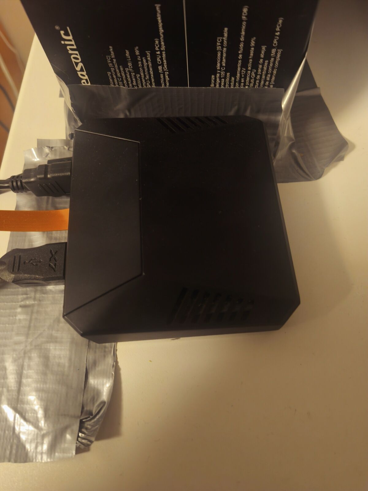
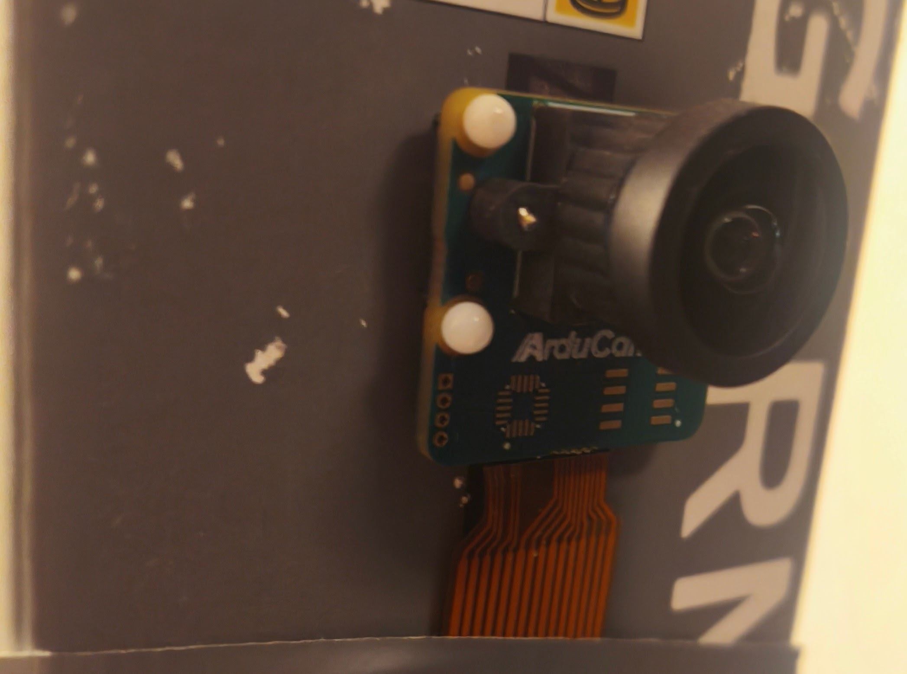
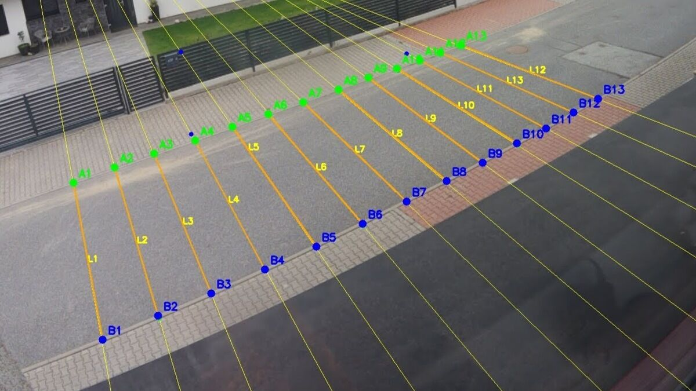
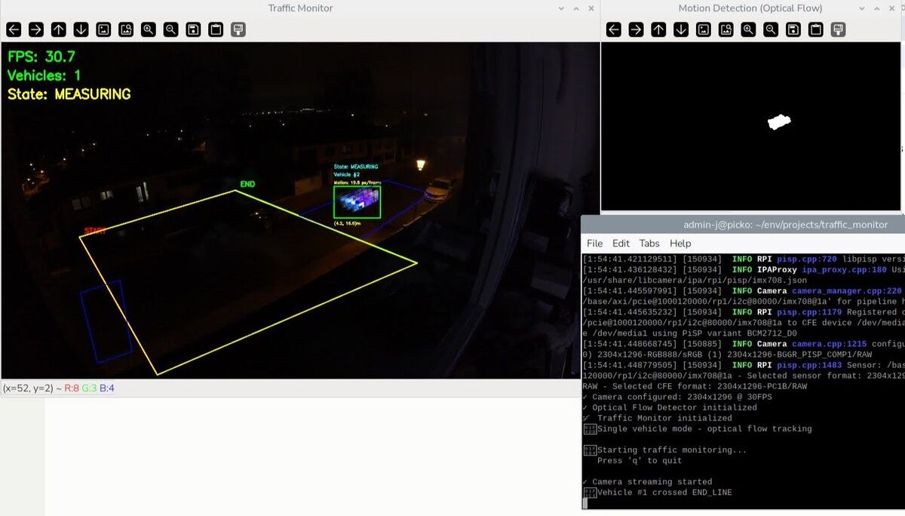

# Traffic Speed Monitoring on Raspberry Pi 5

> A personal side project exploring end‑to‑end vehicle speed measurement from a window‑mounted camera using only a Raspberry Pi 5, geometry and classical computer vision.

This repository documents my ongoing attempt to build a **fully local traffic speed monitor**: from camera mounting and calibration, through homography and pixel‑to‑meter conversion, to real‑time motion tracking and speed estimation on a constrained embedded device. 

The code is deliberately tailored to **one specific street and camera setup** and is not meant to be a drop‑in solution – it is primarily a showcase of my initiative, experimentation and engineering process. 

---

##  Overview

The system observes a residential street from a fixed camera mounted behind a window.  Vehicles enter the scene from either side, pass through a pre‑defined **measurement corridor** between two trigger lines, and their speed is estimated in km/h using a calibrated perspective transform (homography). 

Instead of deep learning, the project focuses on **classical methods that run comfortably on a Raspberry Pi 5**: 

- Optical flow–based motion detection tuned to ignore parked cars and background clutter.   
- A hand‑crafted coordinate system built from a grid of A/B calibration points on the road.   
- Simple state machine for “single‑vehicle at a time” speed measurement between start/end lines. 

Everything runs **fully on‑device** – no cloud, no GPU, just Python + OpenCV on the Pi. 

---

##  Hardware & Scene

### Camera Rig

The hardware setup is intentionally simple and a bit improvised – a small 3D‑printed / taped enclosure with a Raspberry Pi 5 inside, mounted near the window and connected to power and network. 

Raspberry Pi 5 (4 GB)
Arducam IMX708 (12 MP, wide‑angle lens)
USB‑C 27 W power supply
microSD card with Raspberry Pi OS (Bookworm, 64‑bit)

The camera module is taped to a rigid support so that the viewpoint is stable over long periods (important for homography and trigger lines). 

### Camera Module

Close‑up of the Arducam IMX708 wide‑angle module used for the project. 

---

##  Geometry & Calibration

To convert pixel motion into real‑world speed, the project uses a **manual calibration grid** drawn directly on a captured frame of the street. 

On this image, two curves of points (A1–A13 and B1–B13) follow the near and far edges of the lane.  Vertical connectors form a fan of lines L1–L13, approximating equal distances in meters along the road.  From these correspondences, a 3×3 homography matrix is computed and stored in `config/homography_matrix.txt`. 

This homography allows the system to:

- Map any image coordinate \((x_\text{px}, y_\text{px})\) to **world coordinates** \((x_\text{m}, y_\text{m})\) in meters.   
- Define **trigger lines** (START/END) and the **measurement corridor** directly in world space and then project them back into pixels. 

The calibration is intentionally “old‑school” and fully transparent, which makes it easy to reason about what the system is doing. 

---

##  Detection & Speed Estimation

### Motion Detection

Earlier versions used background subtraction (MOG2), which struggled with parked cars and lighting changes.  The current iteration experiments with **optical flow (Lucas–Kanade)** to track feature points between frames and build a heatmap of genuine motion. 

The pipeline:

1. Detect good feature points in the current grayscale frame.   
2. Track them from the previous frame using `cv2.calcOpticalFlowPyrLK`.   
3. Compute motion magnitude in pixels/frame for each point and keep only sufficiently fast ones.   
4. Aggregate motion into blobs → bounding boxes representing moving vehicles.   
5. Filter detections by configurable pre‑detection polygons so that only vehicles entering the road are considered. 

This is lightweight enough to keep **25–30 FPS** on Raspberry Pi 5 while ignoring completely static objects. 

### Single‑Vehicle State Machine

Given that the observed street is relatively quiet, the project deliberately assumes **one relevant vehicle at a time**. 

A simplified state machine:

IDLE → vehicle enters pre‑detection zone
MEASURING → first trigger line crossed
SPEED_ESTIMATED → second trigger line crossed
RESET → back to IDLE for the next vehicle

At the first crossing, the system stores time \(t_1\) and world position \(\mathbf{p}_1\).  At the second crossing, it stores \(t_2\) and \(\mathbf{p}_2\).  The speed is then:

\[
v_\text{km/h} = \frac{\|\mathbf{p}_2 - \mathbf{p}_1\|}{t_2 - t_1} \cdot 3.6
\]

with sanity checks to reject unrealistically low/high values. 

---

##  Live View

The main window shows the live camera feed enriched with the current geometry and detection overlay. 

Typical overlay:

- Red line – **START** trigger line.   
- Green line – **END** trigger line.   
- Yellow polygon – **measurement corridor** between the two lines.   
- Blue polygons – **pre‑detection zones** where vehicles are first picked up.   
- Green/yellow bounding box – currently tracked vehicle, with motion magnitude in px/frame. 

A second window displays a motion heatmap based on optical flow, which is very helpful for debugging and tuning thresholds. 

---

##  Repository Snapshot

The codebase is intentionally small and opinionated; everything is centered around one scene and one camera. 

traffic_monitor/
├── main.py # Orchestrates camera, detection, visualization
│
├── config/
│
│ └── homography_matrix.txt
│
├── modules/
│
│ ├── camera_manager.py # Picamera2 wrapper for Raspberry Pi 5
│
│ ├── coordinate_system.py# Homography + zones + trigger lines
│
│ ├── optical_flow_detector.py # Motion detection via Lucas–Kanade
│
│ └── speed_calculator.py # Single‑vehicle state machine and speed estimation
│
├── calibration/
│
│ ├── capture_frame.py # One‑shot frame capture for calibration
│
│ ├── A_B_points_road.py # Interactive marking of A/B points
│
│ └── homography_final_calc.py # Computes homography matrix
│
└── images/ # Photos and screenshots used in this README

There is no polished installer or configuration UI on purpose – the project is a **snapshot of an evolving experiment**, not a product. 

---

##  What Works Today

- Real‑time camera streaming from Raspberry Pi 5 at ~30 FPS.   
- Stable homography from hand‑picked road points and a known physical distance.   
- Optical‑flow‑based detection of moving vehicles that largely ignores parked cars.   
- Visual overlay with trigger lines, zones and motion diagnostics.   
- Basic speed estimation between two configurable trigger lines for isolated vehicles. 

---

##  What Is Still Rough / In Progress

This is very much a **work in progress**:

- Speed estimates are still being validated against GPS / real‑world measurements.   
- Trigger lines and zones are hand‑tuned for a single camera position; moving the rig requires recalibration.   
- Optical flow thresholds and contour sizes are scene‑specific and not auto‑adapted.   
- Only a single vehicle at a time is supported; no multi‑object tracking yet.   
- No logging or analytics layer – measurements are currently printed to the console only. 

Future iterations might explore lightweight deep‑learning detectors (e.g. tiny YOLO variants) and proper multi‑target tracking, but the current focus is on understanding the limits of classical vision tools on cheap hardware. 

---

##  Motivation

This project grew out of curiosity: **how far can one get with geometry, OpenCV and a Raspberry Pi before reaching for heavy deep learning models?**  It combines several interests – embedded systems, control/measurement, and computer vision – in a single, tangible use case literally outside the window. 

Even if nobody ever clones this repository, it serves as a living portfolio piece showing how a complete system can be designed, calibrated, debugged and iterated on under real‑world constraints. 
